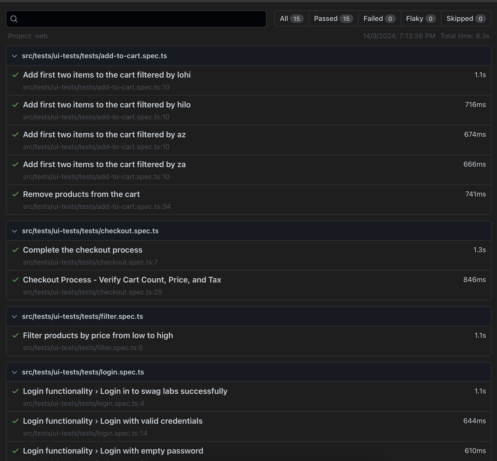

### Project Name 
    * Droneshield UI E-Commerce Testing Suite

## Overview
This repository contains automated tests for the e-commerce application [Sauce Demo](https://www.saucedemo.com/) using Playwright and TypeScript.

## Features Covered
- Login
- Filtering
- Product Listing Page
- Product Details Page
- Cart
- Checkout

Before you begin, ensure you have met the following requirements:

- **Git**: Ensure you have Git installed. You can download it from [git-scm.com](https://git-scm.com/).
- **Node.js and yarn**: Make sure you have Node.js and yarn installed. You can download them from [nodejs.org](https://nodejs.org/). Verify the installation by running:
  ```bash
  node -v
  npm -v
  ```

## Installation
1. Clone the repository:
   ```bash
   git clone https://github.com/podupu/droneshield_ui.git
   cd droneshield_ui
   ```

2. Install dependencies:
   ```bash
   npm install
   ```

3. Install dependencies:
   ```bash
   npx playwright install
   ```

## Project Structure

Here's a brief overview of the project structure:

```
droneshield/
├── src/
│   ├── tests/
│   │   ├── pages/
│   │   └── test/
│   ├── constants/
│   │   └── selector.ts
├── .circleci/
    ├── config.yml
├── package.json
├── tsconfig.json
└── README.md
├── DockerFile
├── playwright.config.ts
└── .gitgnore
```


## Run tests

* Run all tests:
    ```bash
    npx playwright test
    ```

* Run web tests:
    ```bash
    npm run pw:headless:all
    ```

## CI/CD Architecture

Complete end-to-end CI/CD is accomplished using:

* [CircleCI](https://circleci.com/gh/PODHUPU/petcircle/tree/master)
* [Docker](https://hub.docker.com/)

### Reports

**Web Chrome Report**

* View the web test report by opening `playwright report` located in the `playwright-report/` folder.
    

## Contributing

To contribute to this project, follow these steps:

1. Fork the repository.
2. Create a new branch (`git checkout -b feature-branch`).
3. Make your changes and commit them (`git commit -m 'Add some feature'`).
4. Push to the branch (`git push origin feature-branch`).
5. Create a pull request.

## Reporting Bugs
Refer to [BUGREPORT-1.md](BUGREPORT-1.md) for guidelines on reporting bugs.

## Excerise task
Refer to [EXERCISE-1.md](EXERCISE-1.md)

## License
This project is licensed under the MIT License.